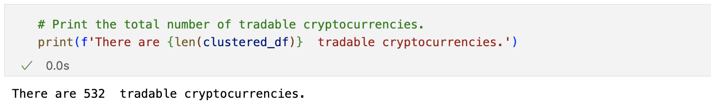
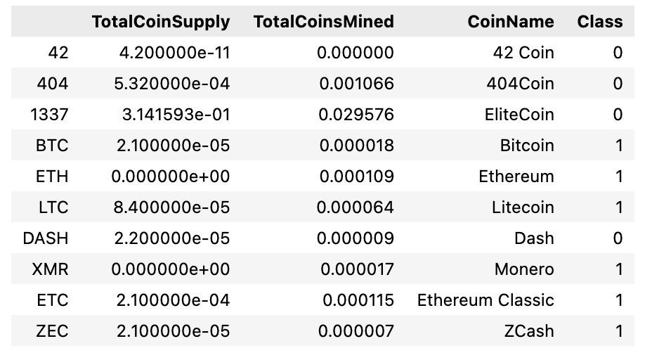
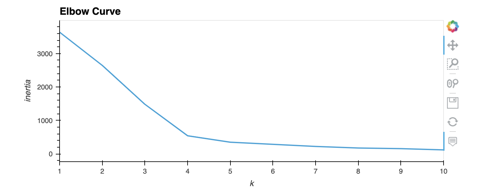
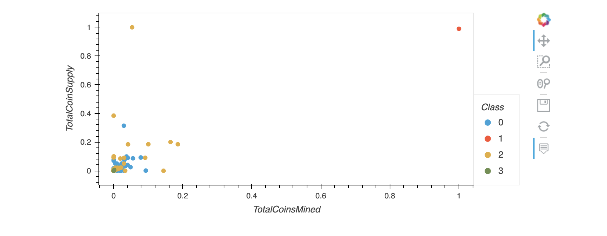
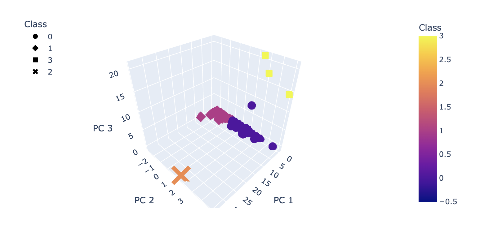

# Cryptocurrencies

## Overview

The purpose of this project was to process data about cryptocurrencies, and then create a report which includes which cryptocurrencies are on the trading market, and how they can be grouped and classified for this investment. Utilizing Pandas and Unsupervized Machine Learning, the data was first reprocessed before being reduced, fit, and then visualized. 

## Results

After cleaning the data and placing it into a DataFrame, <b>532 tradeable cryptocurrencies</b> were found.

<b>The DataFrame was used to plot results:</b>

<b> An Elbow Curve was created using the K-means clustering Algorithm </b>:

<b> A scatterplot was made to visualize the clustered currencies</b>:

<b> A 3-D Scatterplot was also visulized </b>:

